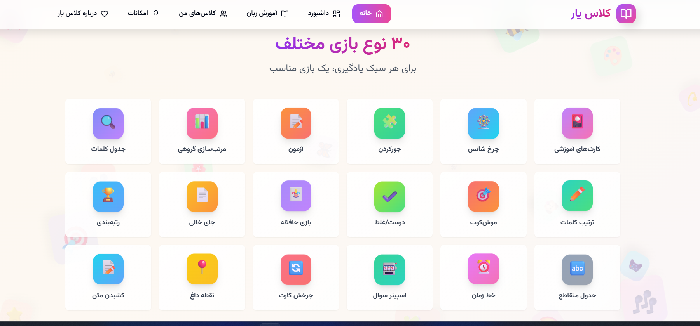
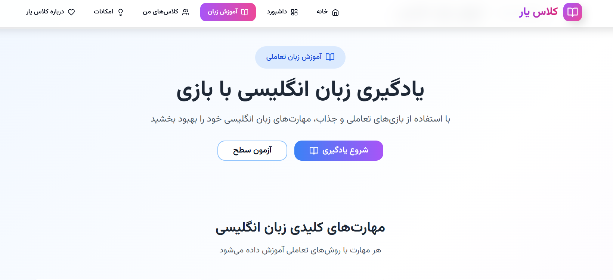
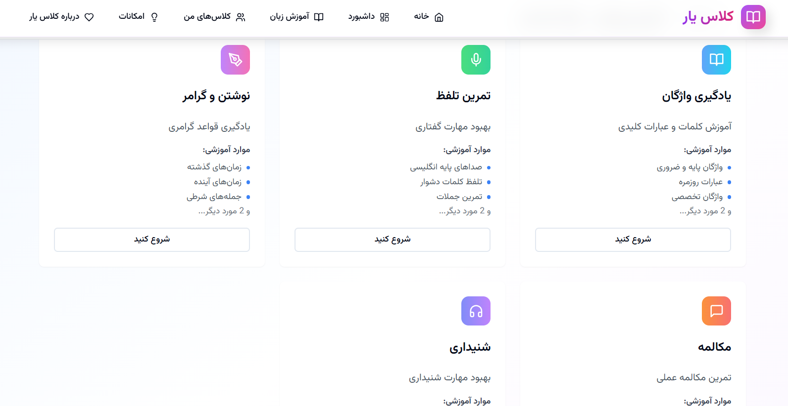
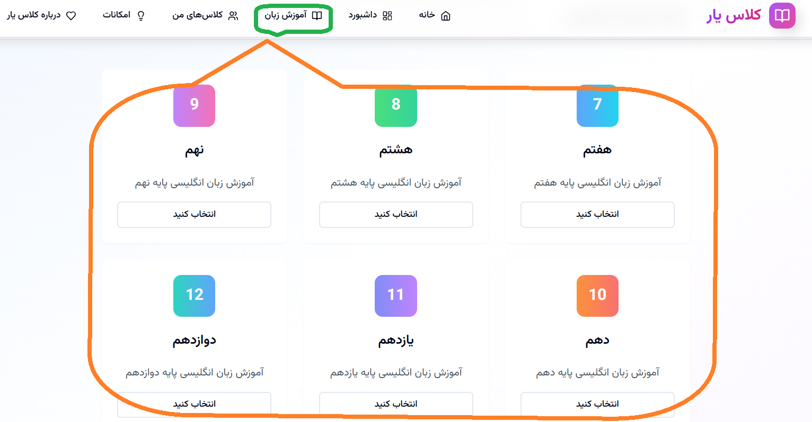
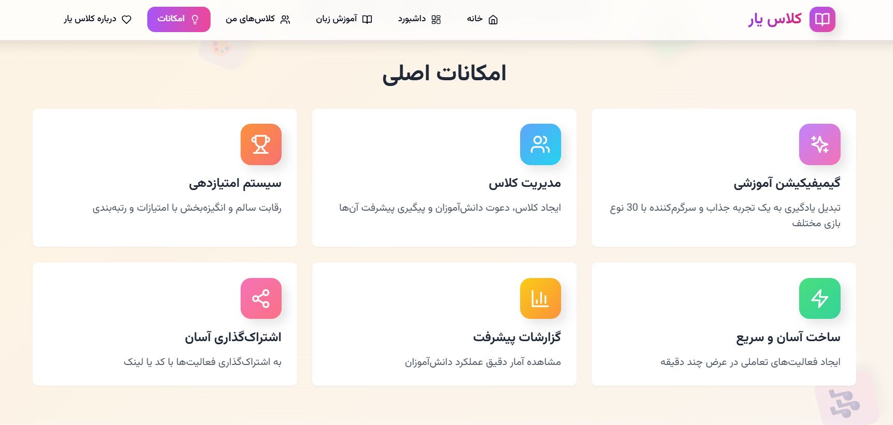
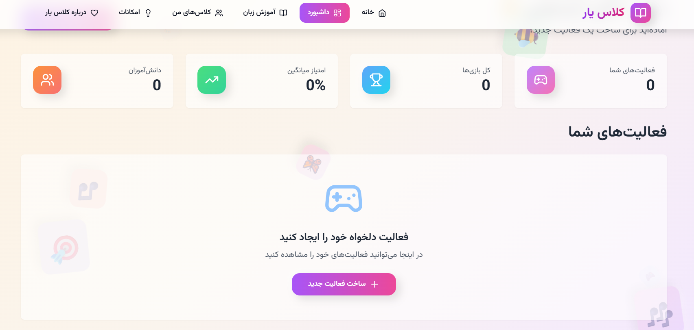
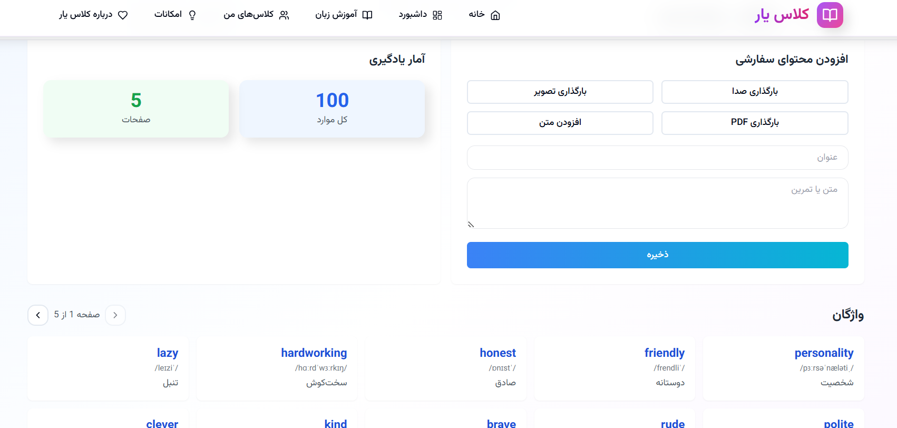

<div dir="rtl" align="center">

<br>

<h1 style="font-size:3.5rem;font-weight:900;color:#7c3aed;text-shadow:2px 2px 4px rgba(0,0,0,0.1)">🎮 کلاس یار</h1>

<br>

### <span style="font-size:1.4rem;color:#6b21a8">**KlassYar** — Educational Gamification Platform</span>

<br>

<span>
  
  
  
  
</span>

<br><br>

**یادگیری را با بازی‌های تعاملی و جذاب به یک تجربه شگفت‌انگیز تبدیل کنید** 🌈✨
 <br> <br>
 
  https://smh-ai-dev.github.io/klassyar

<br>

[](https://klassyar.ir)
[](https://github.com/SMH-AI-Dev/klassyar/issues/new?labels=bug)
[](https://github.com/SMH-AI-Dev/klassyar/issues/new?labels=enhancement)

</div>

<br>

---

<br>



<br>

<div dir="rtl">

## <span style="font-size:2rem">✨    (✿◠‿◠)    ویژگی‌ها</span>

<br>

<div align="center">

| 🎯 **۳۰ نوع بازی** | 👩‍🏫 **ابزارهای معلم** | 📱 **PWA & آفلاین** |
|:---:|:---:|:---:|
| 🇮🇷 **RTL کامل فارسی** | 📐 **واکنش‌گرا** | 🎨 **Clay Design** |

</div>

<br>

<div style="display:flex;flex-wrap:wrap;gap:20px;align-items:flex-start">

<div style="flex:1;min-width:300px">

### 🎯 **۳۰ نوع بازی آموزشی**

از کارت‌های آموزشی و آزمون گرفته تا بازی‌های تعاملی مثل **موش‌کوب، چرخ شانس، جدول کلمات، هواپیما، مارپیچ، مسابقه تلویزیونی** و...

</div>

<div style="flex:1;min-width:300px">



</div>

</div>

<br>

<div style="display:flex;flex-wrap:wrap;gap:20px;align-items:flex-start">

<div style="flex:1;min-width:300px">

### 👩‍🏫 **ابزارهای معلم**

| | |
|---|---|
| ✅ ساخت آسان فعالیت با چند کلیک | ✅ مدیریت کلاس و دعوت دانش‌آموزان |
| ✅ گزارش پیشرفت و آمار عملکرد | ✅ اشتراک‌گذاری با لینک و QR Code |
| ✅ خروجی PDF و چاپ فعالیت‌ها | ✅ ویرایش و بازنشر فعالیت‌ها |

</div>

<div style="flex:1;min-width:300px">



</div>

</div>

<br>

<div style="display:flex;flex-wrap:wrap;gap:20px;align-items:flex-start">

<div style="flex:1;min-width:300px">

### 🎓 **تجربه دانش‌آموز**

- رابط کاربری جذاب و کودکانه
- یادگیری غیرمستقیم با بازی
- سیستم امتیاز و رقابت سالم
- انیمیشن‌های شاد و سرگرم‌کننده
- قابلیت نصب روی موبایل (PWA)

</div>

<div style="flex:1;min-width:300px">



</div>

</div>

<br>

<div style="display:flex;flex-wrap:wrap;gap:20px;align-items:flex-start">

<div style="flex:1;min-width:300px">

### 🌐 **قابلیت‌های فنی**

- **RTL کامل** برای زبان فارسی
- **Clay Morphism Design** — طراحی سه‌بعدی نرم
- **مقاوم و آفلاین** — ذخیره در مرورگر (localStorage)
- **واکنش‌گرا** — مناسب همه دستگاه‌ها
- **قابلیت نصب** به عنوان PWA روی موبایل و دسکتاپ

</div>

<div style="flex:1;min-width:300px">



</div>

</div>

</div>

<br>

---

<br>

<div dir="rtl">

## <span style="font-size:2rem">📸 اسکرین‌شات‌ها</span>

<br>

<div align="center">

| صفحه اصلی | داشبورد | مدیریت بازی‌ها |
|:---:|:---:|:---:|
|  |  |  |

| بازی | ساخت فعالیت | درباره ما |
|:---:|:---:|:---:|
|  |  |  |

</div>

</div>

<br>

---

<br>

<div dir="rtl">

## <span style="font-size:2rem">🚀 شروع سریع</span>

<br>

### پیش‌نیازها
<div style="font-size:1.1rem">

- Node.js **18** یا بالاتر
- npm یا yarn

</div>

### نصب و اجرا

<div dir="ltr">

```bash
# Clone project
git clone https://github.com/SMH-AI-Dev/klassyar.git
cd klassyar

# Install dependencies
npm install

# Start development server
npm run dev
```

</div>

برنامه در آدرس `http://localhost:3000` در دسترس خواهد بود.

### ساخت نسخه نهایی

<div dir="ltr">

```bash
npm run build      # Build for production
npm run preview    # Preview production build
```

</div>

</div>

<br>

---

<br>

<div dir="rtl">

## <span style="font-size:2rem">🛠 تکنولوژی‌ها</span>

<br>

<div align="center">

| تکنولوژی | کاربرد |
|:---:|:---:|
|  | کتابخانه اصلی رابط کاربری |
|  | ابزار بیلد و توسعه |
|  | مسیریابی پیشرفته |
|  | مدیریت state و درخواست‌ها |
|  | فریم‌ورک CSS |
|  | انیمیشن‌های حرفه‌ای |
|  | آیکون‌های SVG |
|  | درخواست‌های HTTP |

</div>

</div>

<br>

---

<br>

<div dir="rtl">

## <span style="font-size:2rem">🎮 راهنمای بازی‌ها</span>

<br>

### ✅ فعال (Complete)
<div dir="ltr">

| بازی | Create | Play | Edit |
|:---|---:|:---:|:---:|
| 🎴 **کارت‌های آموزشی** (Flashcard) | ✅ | ✅ | ✅ |
| 📝 **آزمون** (Quiz) | ✅ | ✅ | ✅ |
| 🧩 **جورکردنی** (Matching) | ✅ | ✅ | ✅ |
| 📊 **مرتب‌سازی گروهی** (Group Sort) | ✅ | ✅ | ✅ |
| 🃏 **بازی حافظه** (Memory Game) | ✅ | ✅ | ✅ |
| 🎡 **چرخ گردان** (Random Wheel) | ✅ | ✅ | ✅ |
| ✔️ **درست یا غلط** (True/False) | ✅ | ✅ | ✅ |
| ✏️ **ترتیب کلمات** (Unjumble) | ✅ | ✅ | ✅ |
| 🎯 **موش‌کوب** (Whack-a-Mole) | ✅ | ✅ | ✅ |
| 🔍 **پیدا کردن کلمه** (Word Search) | ✅ | ✅ | ✅ |
| 📄 **جای خالی** (Fill in the Blank) | ✅ | ✅ | ❌ |
| 🏆 **رتبه‌بندی** (Ranking) | ✅ | ✅ | ✅ |
| 🎰 **اسپینر** (Spinner) | ✅ | ✅ | ✅ |
| 🎈 **بادکنک** (Balloon Pop) | ✅ | ✅ | ❌ |
| 🎪 **چرخ مسابقه** (Gameshow Quiz) | ✅ | ✅ | ❌ |
| 🔤 **آناگرام** (Anagram) | ✅ | ✅ | ❌ |
| ✈️ **هواپیما** (Airplane) | ✅ | ✅ | ❌ |
| 🎴 **کاشی چرخان** (Flip Tiles) | ✅ | ✅ | ❌ |
| 📷 **آزمون تصویری** (Image Quiz) | ✅ | ✅ | ❌ |
| 🏷️ **نمودار برچسب‌دار** (Labelled Diagram) | ✅ | ✅ | ❌ |
| 🎁 **جعبه را باز کن** (Open the Box) | ✅ | ✅ | ❌ |
| 🎲 **کارت تصادفی** (Random Cards) | ✅ | ✅ | ❌ |
| 🗺️ **مارپیچ** (Maze Chase) | ✅ | ✅ | ❌ |
| 🔗 **خط زمانی** (Timeline) | ✅ | ✅ | ❌ |
| 🔥 **نقطه داغ** (Hotspot) | ✅ | ✅ | ❌ |
| 📝 **کشیدن متن** (Drag the Text) | ✅ | ✅ | ❌ |
| 💀 **چوبه‌دار** (Hangman) | ✅ | ✅ | ❌ |
| ❌ **کلمه گمشده** (Missing Word) | ✅ | ✅ | ❌ |
| 🔀 **جدول کلمات** (Crossword) | ✅ | ✅ | ❌ |
| 🃏 **چرخش کارت** (Card Flip) | ✅ | ✅ | ❌ |

</div>

</div>

<br>

---

<br>

<div dir="rtl">

## <span style="font-size:2rem">📁 ساختار پروژه</span>

<br>

<div dir="ltr">

```
klassyar/
├── .github/                    # GitHub templates
├── public/                     # Static files
│   ├── screenshots/            # App screenshots
│   ├── icon.svg
│   ├── manifest.json
│   └── sw.js
├── src/
│   ├── api/                    # API client (mock)
│   │   └── base44Client.js
│   ├── components/             # React components
│   │   ├── ui/                 # Base UI components
│   │   ├── layout/             # Layout (Navbar, Layout)
│   │   ├── dashboard/          # Dashboard components
│   │   └── shared/             # Shared components
│   ├── pages/                  # All pages
│   │   ├── Create*.jsx         # 30 Create pages
│   │   ├── Play*.jsx           # 30 Play pages
│   │   ├── Edit*.jsx           # 13 Edit pages
│   │   └── *.jsx               # Other pages
│   ├── hooks/                  # Custom React hooks
│   ├── lib/                    # Library helpers
│   ├── utils/                  # Utility functions
│   ├── App.jsx                 # Root component
│   ├── main.jsx                # Entry point
│   └── index.css               # Global styles
├── index.html                  # HTML template
├── package.json
├── vite.config.js
├── tailwind.config.js
└── postcss.config.js
```

</div>

</div>

<br>

---

<br>

<div dir="rtl">

## <span style="font-size:2rem">🤝 مشارکت</span>

<br>

لطفاً برای مشارکت در توسعه:

1. **Fork** کنید
2. **Branch** جدید بسازید (`git checkout -b feature/amazing-feature`)
3. **Commit** کنید (`git commit -m 'Add amazing feature'`)
4. **Push** کنید (`git push origin feature/amazing-feature`)
5. **Pull Request** باز کنید

<br>

</div>

---

<br>

<div dir="rtl">

## <span style="font-size:2rem">📞 ارتباط با ما</span>

<br>

<div align="center">

<span style="font-size:2.5rem;margin:0 8px">📧</span>
<span style="font-size:1.8rem;margin:0 8px">🌐</span>
<span style="font-size:2.8rem;margin:0 8px">📱</span>
<span style="font-size:2rem;margin:0 8px">💬</span>
<span style="font-size:2.5rem;margin:0 8px">📨</span>
<span style="font-size:1.8rem;margin:0 8px">🤝</span>

<br><br>

<div style="background:linear-gradient(135deg,#fef2f2,#fff7ed,#fefce8);border-radius:16px;padding:20px 30px;margin-bottom:25px;display:inline-block;text-align:center;box-shadow:0 4px 12px rgba(0,0,0,.06)">
  <span style="font-size:1.4rem;font-weight:bold;color:#dc2626">⚠️</span>
  <span style="font-size:1.1rem;color:#4b5563">
    گزارش هرگونه <strong>ایراد</strong> 🐛، <strong>بحران</strong> 🚨، <strong>پیشنهاد</strong> 💡 یا <strong>انتقاد</strong> 🤔
  </span>
  <br>
  <span style="font-size:1.2rem;color:#7c3aed;font-weight:bold">
    📬 خوشحال می‌شویم نظرات شما را بشنویم — از طریق راه‌های ارتباطی زیر با ما در تماس باشید ✨
  </span>
</div>

<br>

<div style="background:linear-gradient(135deg,#f5f3ff,#fdf2f8);border-radius:20px;padding:30px 40px;display:inline-block;text-align:center;box-shadow:0 4px 15px rgba(0,0,0,.08)">

<span style="font-size:1.8rem">👤</span> **مهندس سید مهدی حسینی**
<br><br>
<span style="font-size:1.3rem;color:#6b21a8">_Engineer Seyed Mehdi Hosaini_</span>
<br><br>
<span style="font-size:1.3rem">📧</span> **Email:** smh.4tecksoftware@gmail.com
<br>
<span style="font-size:1.3rem">📧</span> **Email:** klasyar.smh@gmail.com
<br><br>
<span style="font-size:1.3rem">📞</span> **Tel:** +989024912785

</div>

<br><br>

<span style="font-size:2rem;margin:0 8px">⭐</span>
<span style="font-size:2.8rem;margin:0 8px">🌟</span>
<span style="font-size:2.2rem;margin:0 8px">💫</span>
<span style="font-size:3rem;margin:0 8px">✨</span>
<span style="font-size:2rem;margin:0 8px">⭐</span>
<span style="font-size:2.5rem;margin:0 8px">🌟</span>

</div>

<br>

</div>

<hr>

<div align="center">

<br>

❤️

<br>

**ساخته شده با عشق برای آموزش ایران** 🇮🇷

<br>

**نسخه 1.3.0** | © 2026 کلاس یار | تمامی حقوق محفوظ است

<br>

</div>
