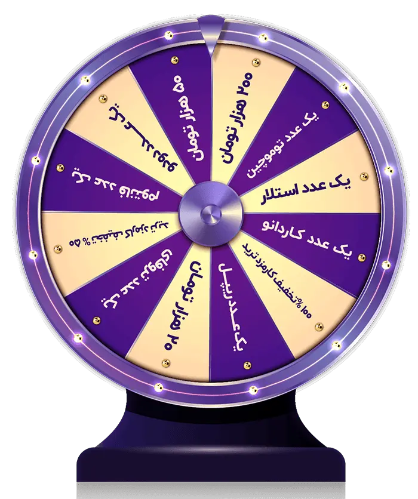
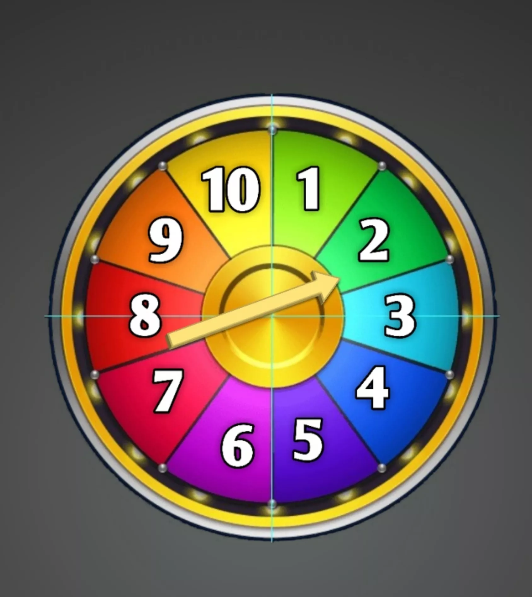
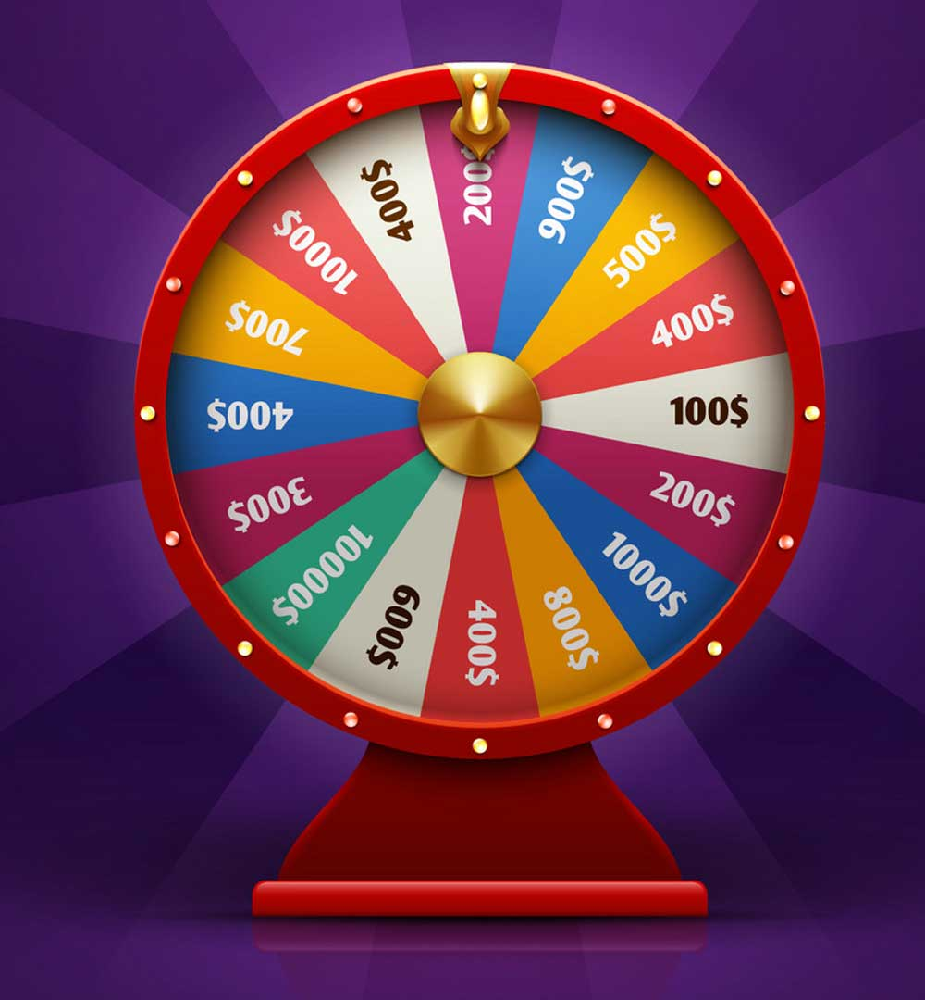

<div dir="rtl" align="center">

# 🎮📚 کلاس یار (KlassYar)

**پلتفرم گیمیفیکیشن آموزشی | Educational Gamification Platform**

[](https://reactjs.org/)
[](https://vitejs.dev/)
[](https://tailwindcss.com/)
[](https://www.framer.com/motion/)
[](LICENSE)
[](package.json)

**یادگیری را با بازی‌های تعاملی و جذاب به یک تجربه شگفت‌انگیز تبدیل کنید**

[مشاهده دمو](#) • [گزارش باگ](https://github.com/smh1317/klassyar/issues/new?labels=bug&template=bug_report.md) • [درخواست ویژگی](https://github.com/smh1317/klassyar/issues/new?labels=enhancement&template=feature_request.md)

---

</div>

<div dir="rtl">

## ✨ ویژگی‌ها

### 🎯 30 نوع بازی آموزشی
از کارت‌های آموزشی و آزمون گرفته تا بازی‌های تعاملی مثل موش‌کوب، چرخ شانس، جدول کلمات و...

### 👩‍🏫 ابزارهای معلم
- ساخت آسان فعالیت با چند کلیک
- مدیریت کلاس و دعوت دانش‌آموزان
- گزارش پیشرفت و آمار عملکرد
- اشتراک‌گذاری با لینک و QR Code
- خروجی PDF و چاپ فعالیت‌ها

### 🎓 تجربه دانش‌آموز
- رابط کاربری جذاب و کودکانه
- یادگیری غیرمستقیم با بازی
- سیستم امتیاز و رقابت سالم
- انیمیشن‌های شاد و سرگرم‌کننده

### 🌐 قابلیت‌های فنی
- **RTL کامل** برای زبان فارسی
- **Clay Morphism Design** - طراحی سه‌بعدی نرم
- **مقاوم و آفلاین** - ذخیره در مرورگر
- **واکنش‌گرا** - مناسب همه دستگاه‌ها
- **قابلیت نصب** به عنوان PWA

---

## 🚀 شروع سریع

### پیش‌نیازها
- Node.js 18 یا بالاتر
- npm یا yarn

### نصب و اجرا

```bash
# clone project
git clone https://github.com/smh1317/klassyar.git
cd klassyar

# install dependencies
npm install

# start development server
npm run dev
```

برنامه در آدرس `http://localhost:3000` در دسترس خواهد بود.

### ساخت نسخه نهایی

```bash
npm run build      # build for production
npm run preview    # preview production build
```

---

## 📸 اسکرین‌شات‌ها

| صفحه اصلی | داشبورد | بازی |
|-----------|----------|------|
|  |  |  |

> اسکرین‌شات‌های بیشتری در پوشه `src/` موجود است.

---

## 🛠 تکنولوژی‌ها

| تکنولوژی | کاربرد |
|-----------|--------|
| **React 18** | کتابخانه اصلی رابط کاربری |
| **Vite 5** | ابزار بیلد و توسعه |
| **React Router v6** | مسیریابی پیشرفته |
| **TanStack Query** | مدیریت state و درخواست‌ها |
| **Tailwind CSS 3** | فریم‌ورک CSS |
| **Framer Motion** | انیمیشن‌های حرفه‌ای |
| **Lucide React** | آیکون‌های SVG |
| **@hello-pangea/dnd** | کشیدن و رها کردن |
| **axios** | درخواست‌های HTTP |

---

## 📁 ساختار پروژه

```
klassyar/
├── .github/                  # GitHub templates
├── public/                   # Static files
├── src/
│   ├── api/                  # API clients
│   │   └── base44Client.js   # Mock API (localStorage)
│   ├── components/           # React components
│   │   ├── ui/               # Base UI components
│   │   ├── layout/           # Layout components
│   │   ├── dashboard/        # Dashboard components
│   │   └── shared/           # Shared components
│   ├── pages/                # Page components
│   │   ├── Create*.jsx       # Activity creation pages
│   │   ├── Play*.jsx         # Game play pages
│   │   ├── Edit*.jsx         # Activity edit pages
│   │   └── *.jsx             # Other pages
│   ├── lib/                  # Library helpers
│   ├── utils/                # Utility functions
│   ├── App.jsx               # Root component
│   ├── main.jsx              # Entry point
│   └── index.css             # Global styles
├── index.html                # HTML template
├── package.json
├── vite.config.js
├── tailwind.config.js
└── postcss.config.js
```

---

## 🎮 راهنمای بازی‌ها

### فعال
| بازی | Create | Play | Edit |
|------|--------|------|------|
| 🎴 کارت‌های آموزشی | ✅ | ✅ | ✅ |
| 📝 آزمون | ✅ | ✅ | ✅ |
| 🧩 جورکردنی | ✅ | ✅ | ✅ |
| 📊 مرتب‌سازی گروهی | ✅ | ✅ | ✅ |
| 🃏 بازی حافظه | ✅ | ✅ | ✅ |
| 🎡 چرخ گردان | ✅ | ✅ | ✅ |
| ✔️ درست یا غلط | ✅ | ✅ | ✅ |
| ✏️ ترتیب کلمات | ✅ | ✅ | ✅ |
| 🎯 موش‌کوب | ✅ | ✅ | ✅ |
| 🔍 پیدا کردن کلمه | ✅ | ✅ | ✅ |
| 📄 جای خالی | ✅ | ✅ | ❌ |
| 🏆 رتبه‌بندی | ✅ | ✅ | ✅ |
| 🎰 اسپینر | ✅ | ✅ | ✅ |

### در حال توسعه
| بازی | وضعیت |
|------|--------|
| جدول کلمات متقاطع، خط زمانی، نقطه داغ، کشیدن متن | ❌ ساخته نشده |
| ترکیدن بادکنک، مسابقه تلویزیونی، مارپیچ، هواپیما | ❌ ساخته نشده |
| باز کردن جعبه، کلمه گمشده، آناگرام، چوبه‌دار | ❌ ساخته نشده |
| کاشی چرخان، آزمون تصویری، نمودار برچسب‌دار، کارت تصادفی | ❌ ساخته نشده |

---

## 🤝 مشارکت

لطفاً برای مشارکت در توسعه:
1. Fork کنید
2. Branch جدید بسازید (`git checkout -b feature/amazing-feature`)
3. Commit کنید (`git commit -m 'Add amazing feature'`)
4. Push کنید (`git push origin feature/amazing-feature`)
5. Pull Request باز کنید

[راهنمای کامل مشارکت](CONTRIBUTING.md)

---

## 📜 مجوز

این پروژه تحت لیسانس **MIT** منتشر شده است. جهت اطلاعات بیشتر فایل [LICENSE](LICENSE) را مشاهده کنید.

---

## 📞 ارتباط با ما

- **ایمیل**: klasyar.smh@gmail.com
- **معمار سیستم**: سید مهدی حسینی - smh.4tecksoftware@gmail.com
- **Telegram**: @smh1317

---

<div align="center">

**ساخته شده با ❤️ برای آموزش ایران**

**نسخه 1.2.0**

</div>

</div>
